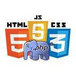
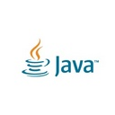

## РЕЗЮМЕ

### Содержание

<p>
  <ul>
    <li><b><a href="#личные-данные">Личные данные</a></b></li>
    <li><b><a href="#цели">Цели</a></b></li>
    <li><b><a href="#опыт-в-программировании">Опыт в программировании</a></b></li>
    <li><b><a href="#образование">Образование</a></b></li>
    <li><b><a href="#знание-английского">Знание английского</a></b></li>
  </ul>
</p>

---

### Личные данные

* ФИО: Абжаппаров Максат Темирханович
* Эл. почта: abzhapparovmaxat@gmail.com
* Тел.: +7 705 191 8060

---

### Цели

<table>
  <tr>
    <td width="100">
       </td>
    <td>
      <p align="left"><br>
        1) Стать специалистом в сфере веб-програмирования, к которой я уже иду, но этот путь без наставника словно путь в темном гараже с разложенными на полу граблями. Идешь быстро - совершишь ошибку, наступая на грабли. Не желая наступить на грабли - идешь медленно. Наставник же это фонарь в руке, с которым можно идти быстро и без ошибок.<br><br>
        2) Получать деньги за то, что мне нравится делать. Из чего следует независимость от других дел, что позволить мне еще больше делать то, что нравится.<br>
      </p>
    </td>
  </tr>
</table>

>Выберите себе работу по душе, и вам не придется работать ни одного дня в своей жизни. © Конфуций

---

### Опыт в программировании

<table>
  <tr>
    <td width="100">
      </td>
    <td>
      <p align="left"><br>
        Решение тривиальных задач: <b>PHP</b>, <b>HTM5/CSS/JS(jQuery)</b>. Создание простых сайтов. От дизайна и верстки до создание простого CMS.<br><br>
        Проекты:
        <ul>
          <li><b><a target="_blank" href="http://karazhal.gov.kz/ru/">Информационный портал Аппарата акима города Каражал</a></b></li>
          <li><b><a target="_blank" href="http://library.karazhal.gov.kz/">Сайт Централизованной Библиотечной Системы города Каражал</a></b></li>
        </ul><br>
      </p>
    </td>
  </tr>
  <tr>
    <td width="100">
       </td>
    <td>
      <p align="left"><br>
        Решение тривиальных задач: <b>JAVA</b>. Создание простых приложений для Android.<br><br>
        Проекты:
        <ul>
          <li><b><a target="_blank" href="https://play.google.com/store/apps/developer?id=abzhapparovmaxat">Google Play</a></b></li>
        </ul><br>
      </p>
    </td>
  </tr>
</table>

#### Javascript

<p>Фрагмент кода с <a href="http://library.karazhal.gov.kz/">сайта Централизованной Библиотечной Системы города Каражал</a></p>

```javascript

String.prototype.replaceAll = function(a,b) { return this.split(a).join(b) };

var transliteLat = {
  А: "A", а: "a",
  Ә: "Á", ә: "á",
  Б: "B", б: "b",
  Д: "D", д: "d",
  Е: "E", е: "e",
  Ф: "F", ф: "f",
  "Ғ": "Ǵ", "ғ": "ǵ",
  Г: "G", г: "g",
  Х: "H", х: "h",
  І: "I", i: "i",
  І: "I", i: "i",
  И: "I", и: "ı",
  Й: "I", й: "ı",
  H: "H", h: "h",
  Ж: "J", ж: "j",
  К: "K", к: "k",
  Л: "L", л: "l",
  М: "M", м: "m",
  Н: "N", н: "n",
  Ң: "Ń", ң: "ń",
  О: "O", о: "o",
  Ө: "Ó", ө: "ó",
  П: "P", п: "p",
  Қ: "Q", қ: "q",
  Р: "R", р: "r",
  Ш: "Sh", ш: "sh",
  С: "S", с: "s",
  Т: "T", т: "t",
  Ұ: "U", ұ: "u",
  Ү: "Ú", ү: "ú",
  В: "V", в: "v",
  Ы: "Y", ы: "y",
  У: "Ý", у: "ý",
  З: "Z", з: "z",
  Ч: "Ch", ч: "ch",
  Э: "E", э: "e",
  Щ: "", щ: "",
  ь: '',
  ъ:'',
};

var transliteKaz = {
  "Á": "Ә", "á": "ә",
  "A": "А", "a": "а",
  "B": "Б", "b": "б",
  "D": "Д", "d": "д",
  "E": "Е", "e": "е",
  "F": "Ф", "f": "ф",
  "Ǵ": "Ғ", "ǵ": "ғ",
  "G": "Г", "g": "г",
  "H": "Х", "h": "х",
  "I": "І", "i": "i",
  "I": "І", "i": "i",
  "I": "Й", "ı": "й",
  "I": "И", "ı": "и",
  "H": "H", "h": "h",
  "J": "Ж", "j": "ж",
  "K": "К", "k": "к",
  "L": "Л", "l": "л",
  "M": "М", "m": "м",
  "Ń": "Ң", "ń": "ң",
  "N": "Н", "n": "н",
  "Ó": "Ө", "ó": "ө",
  "O": "О", "o": "о",
  "P": "П", "p": "п",
  "Q": "Қ", "q": "қ",
  "R": "Р", "r": "р",
  "Sh": "Ш" "sh": "ш",
  "S": "С", "s": "с",
  "T": "Т", "t": "т",
  "Ú": "Ү", "ú": "ү",
  "U": "Ұ", "u": "ұ",
  "V": "В", "v": "в",
  "Ý": "У", "ý": "у",
  "Z": "З", "z": "з",
  "Ch": "Ч", "ch": "ч",
  "Y": "Ы", "y": "ы",
  "": "Щ", "": "щ"
};

var transliteKaz2 = {
  "Iá": "Иә", "ıá": "иә",
  "Ia": "Я", "ıa": "я",
  "Iý": "Ю", "ıý": "ю",
};

var transliteLat2 = {
  Я: "Ia", я: "ıa",
  Ю: "Iý", ю: "ıý",
  Ц: "Ts", ц: "ts"
};

var convertToLat = function (text) {
  for (var key in transliteLat2) {
    text = text.replaceAll(key.toString(), transliteLat2[key]);
  }
  for (key in transliteLat) {
    text = text.replaceAll(key.toString(), transliteLat[key]);
  }
  return text;  
};

var convertToKaz = function (text) {
  for (var key in transliteKaz2) {
    text = text.replaceAll(key.toString(), transliteKaz2[key]);
  }
  for (key in transliteKaz) {
    text = text.replaceAll(key.toString(), transliteKaz[key]);
  }
  return text;
};

```

#### Java

<p>Фрагмент кода из проекта <a href="https://play.google.com/store/apps/details?id=abzhapparovmaxat.englishwords">YOTAPHONE 2: 1000 английских слов (виджет)</a></p>

```java

  public String Words(int row, String field) {

    String field_value = "";

    AssetDatabaseOpenHelper adoh = new AssetDatabaseOpenHelper(context);
    SQLiteDatabase sqlite_database = adoh.openDatabase();

    Cursor cursor = sqlite_database.rawQuery("SELECT " + field + " FROM englishwords WHERE rowid=" + row, null);

    cursor.moveToFirst();
    field_value = cursor.getString(0);

    return field_value;

  }


  public Void UpdateWord(RemoteViews rv, ComponentName cn, AppWidgetManager awp) {

    try {

      Random random = new Random();
      int r = random.nextInt(1079)+1;

      rv.setTextViewText(R.id.word,  Words(r, "word") + " " +  Words(r, "transcription"));
      rv.setTextViewText(R.id.translation,  Words(r, "translation"));
      rv.setTextViewText(R.id.example,  Words(r, "example"));

      awp.updateAppWidget(cn, rv);
      Epd.fullUpdate(rv, R.id.widget);

    } catch (Error e) {
      e.printStackTrace();
      return null;
    } catch (Exception  e) {
      e.printStackTrace();
      return null;
    }

    return null;

  }

```

---

### Образование

Незаконченный курс по специальности __*Программирование*__ в 2008. С 2015 продолжил обучение самостоятельно.

В 2017 окончил курс __*Колледжа экономики, бизнеса и права (КЭУК)*__ по специальности __*Финансы (по отраслям)*__.

---

### Знание английского

**A1 (Beginner)** Чтение разного рода инструкций со дня знакомства с компьютером (~2000 год), переписка на зарубежных форумах с тех пор как программирование стало моим хобби (~2015 год).
